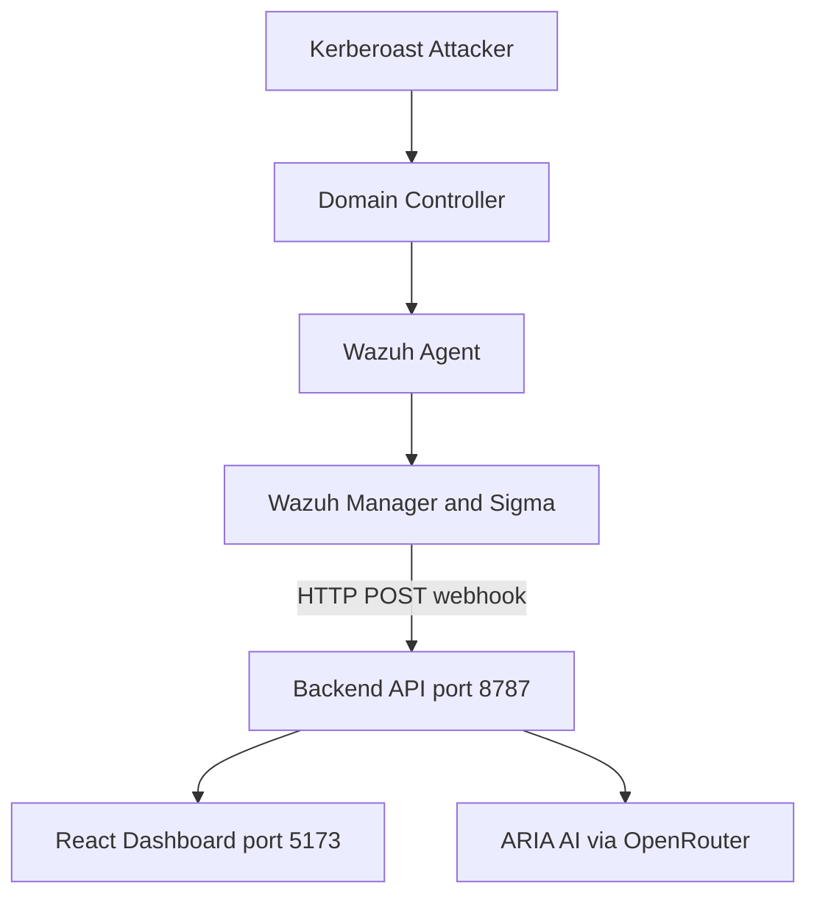

# AuthGraph ITDR

**Identity Threat Detection & Response for Active Directory** — real-time Kerberoasting and AS-REP detection, explainable risk scoring, attack-path visualization, and AI-guided containment.

Built for hackathon demos and SOC workflows: Wazuh pushes alerts in, AuthGraph correlates identity context, ARIA recommends response actions, and analysts approve playbooks with copy-paste PowerShell for lab AD.

---

## Highlights

| Capability | What you get |
|------------|--------------|
| **Live SIEM ingest** | Wazuh webhook → instant incident on the dashboard |
| **Detection engine** | Sigma-matched Kerberoasting (4769) & AS-REP roasting (4768) with risk breakdown |
| **Attack path** | BloodHound-style graph: user → service account → privilege → crown jewel |
| **ARIA AI** | DeepSeek-powered verdict, headline, containment actions, and analyst copilot |
| **Response playbooks** | Approve actions → preview PowerShell → mark done → risk drops |
| **Executive reports** | CISO-grade PDF/DOCX export + HTML email via Resend |
| **Global telemetry** | Live identity threat map with geo correlation |

---

## Architecture



<details>
<summary>Text diagram (if Mermaid does not render)</summary>

```
Attacker ──kerberoast──▶ Domain Controller
                              │
                         Event 4768 / 4769
                              ▼
                        Wazuh Agent → Wazuh Manager
                              │
                    POST /api/webhook/wazuh
                              ▼
              Backend API (8787) ──▶ Dashboard (5173)
                     │
                     └──▶ ARIA AI (OpenRouter)
```

</details>

**Data flow:** Wazuh calls AuthGraph (webhook push). The frontend polls `/api/incidents` and renders the full incident lifecycle — no polling Wazuh from AuthGraph.

---

## Quick start

**Requirements:** Node.js 20+, npm

```powershell
# 1. Clone and install
git clone https://github.com/hackatonteam96-eng/Autograph.git
cd Autograph
npm run install:all

# 2. Configure backend (API keys, optional)
copy backend\.env.example backend\.env
# Edit backend\.env — at minimum set OPENROUTER_API_KEY for ARIA

# 3. Run both API + UI
npm run dev
```

| Service | URL |
|---------|-----|
| **Dashboard** | http://127.0.0.1:5173 |
| **API health** | http://127.0.0.1:8787/api/health |
| **Wazuh webhook** | http://127.0.0.1:8787/api/webhook/wazuh |

---

## LAN demo (judges / blue team)

Bind the stack on all interfaces so others on the network can open the dashboard.

**`backend/.env`**

```env
HOST=0.0.0.0
PORT=8787
AUTHGRAPH_LAN_HOST=YOUR_LAN_IP
ITDR_DASHBOARD_URL=http://YOUR_LAN_IP:5173
```

**`frontend/.env`** (optional — defaults exist in `vite.config.ts`)

```env
VITE_DEV_HOST=0.0.0.0
VITE_LAN_HOST=YOUR_LAN_IP
```

Allow inbound TCP **5173** and **8787** in Windows Firewall, then share:

- Dashboard → `http://YOUR_LAN_IP:5173`
- Webhook → `http://YOUR_LAN_IP:8787/api/webhook/wazuh`

Full Wazuh integration steps: [`BLUE_TEAM.md`](BLUE_TEAM.md)

---

## Wazuh webhook (30 seconds)

Add to Wazuh Manager `/var/ossec/etc/ossec.conf`:

```xml
<integration>
  <name>custom-webhook</name>
  <hook_url>http://YOUR_LAPTOP_IP:8787/api/webhook/wazuh</hook_url>
  <level>10</level>
  <alert_format>json</alert_format>
</integration>
```

Restart the manager, run a kerberoast from the lab, and watch **LIVE WAZUH** appear on the Command tab.

Test connectivity:

```bash
curl http://YOUR_LAPTOP_IP:8787/api/webhook/wazuh
```

---

## Dashboard tour

| Tab | Purpose |
|-----|---------|
| **Command** | Incident hero, ARIA verdict, pipeline status, KPIs |
| **Attack path** | Interactive identity graph |
| **Detection** | MVP verification, Sigma rule, “why this fired” |
| **Response** | Approve AI actions, PowerShell playbook, containment |
| **Logs** | Security event stream (webhooks, AI, actions) |
| **Telemetry** | 3D global threat map |

**ARIA** (bottom-right) — ask for executive briefs, playbook rewrites, or investigation help.

---

## API reference

| Method | Endpoint | Description |
|--------|----------|-------------|
| `GET` | `/api/health` | Service + detection diagnostics |
| `GET` | `/api/incidents` | All incidents for the UI |
| `GET` | `/api/incidents/:id` | Single incident detail |
| `GET` | `/api/attack-path` | Attack graph JSON |
| `GET` | `/api/sigma` | Kerberoasting Sigma YAML |
| `GET` | `/api/explain/:id` | Explainable alert breakdown |
| `GET` | `/api/verify` | MVP verification checklist |
| `POST` | `/api/webhook/wazuh` | Ingest Wazuh alert JSON |
| `POST` | `/api/contain/:id` | Record containment playbook |
| `POST` | `/api/ai/chat` | ARIA analyst chat |
| `POST` | `/api/reports/:id/send` | Email HTML incident report |
| `POST` | `/api/reports/:id/export` | Executive PDF or DOCX |
| `POST` | `/api/simulate/kerberoast` | Demo simulation trigger |
| `POST` | `/api/simulate/reset` | Reset demo / contained state |
| `POST` | `/api/reload` | Reload data from disk |

More detail: [`backend/README.md`](backend/README.md) · [`ARCHITECTURE.md`](ARCHITECTURE.md)

---

## Environment variables

### Backend (`backend/.env`)

| Variable | Description |
|----------|-------------|
| `PORT` | API port (default `8787`) |
| `HOST` | Bind address (`0.0.0.0` for LAN) |
| `OPENROUTER_API_KEY` | ARIA AI via [OpenRouter](https://openrouter.ai) |
| `OPENROUTER_CHAT_MODEL` | Fast chat model (default DeepSeek v4 Flash) |
| `OPENROUTER_REASONING_MODEL` | Reasoning model (default DeepSeek v4 Pro) |
| `RESEND_API_KEY` | Incident email reports |
| `ITDR_REPORT_TO` | Report recipient |
| `ITDR_REPORT_FROM` | Sender address (verify domain in Resend) |
| `ITDR_DASHBOARD_URL` | Link embedded in reports |
| `AUTHGRAPH_LAN_HOST` | LAN IP shown in startup logs |

### Frontend (`frontend/.env`)

| Variable | Description |
|----------|-------------|
| `VITE_API_BASE` | API base (`/api` uses Vite proxy in dev) |
| `VITE_DEV_HOST` | Dev server bind (`0.0.0.0` for LAN) |
| `VITE_LAN_HOST` | HMR host for LAN clients |

---

## Tech stack

| Layer | Stack |
|-------|-------|
| **Frontend** | React 19, TypeScript, Vite 8, Motion, Three.js, React Flow |
| **Backend** | Node.js, Express, JSON data store |
| **Detection** | Custom correlator, Sigma rules, Wazuh filter |
| **AI** | OpenRouter → DeepSeek v4 Flash + Pro |
| **Email** | Resend (HTML incident reports) |
| **SIEM** | Wazuh Manager webhook integration |

---

## Project structure

```
Autograph/
├── frontend/          React dashboard (Vite)
├── backend/           Express API + detection engine
│   └── detection/     Sigma correlator, risk engine, Wazuh parser
├── data/              Alerts, attack path, incident state, event log
├── sigma/             Kerberoasting & AS-REP Sigma rules
├── scripts/           Demo verification & webhook test scripts
├── BLUE_TEAM.md       Wazuh + firewall + LAN setup
├── JUDGE_DEMO.md      5-minute judge demo script
└── ARCHITECTURE.md    System diagram & integration notes
```

---

## Demo scripts

**Judge demo (5 min):** [`JUDGE_DEMO.md`](JUDGE_DEMO.md)

```powershell
npm run dev
.\scripts\verify-e2e.ps1          # automated MVP checks
.\scripts\test-wazuh-webhook.ps1  # simulate webhook without lab
```

**Kerberoast from attacker VM:**

```bash
GetUserSPNs.py corp.local/user:'Pass' -dc-ip DC_IP -request
# or
Rubeus.exe kerberoast /outfile:hashes.txt
```

---

## Tests

```powershell
cd backend
npm test                 # API integration tests
npm run test:detection   # Detection engine unit tests
```

---

## Deploy frontend (Vercel)

The repo includes `vercel.json` for static frontend hosting. Set `VITE_API_BASE` to your live backend URL in Vercel environment variables.

```powershell
npm run build:frontend
```

---

## Team

| Area | Focus |
|------|-------|
| **Frontend & product** | Dashboard, ARIA UX, demo flow |
| **Backend API** | Incidents, containment, webhooks |
| **Detection** | Sigma, risk scoring, correlator |
| **SIEM / lab** | Wazuh, AD, kerberoast PoC |

---

## License

Hackathon project — **Team 96 / AuthGraph**.

For integration help, start with [`BLUE_TEAM.md`](BLUE_TEAM.md) or [`CONNECT.md`](CONNECT.md).
